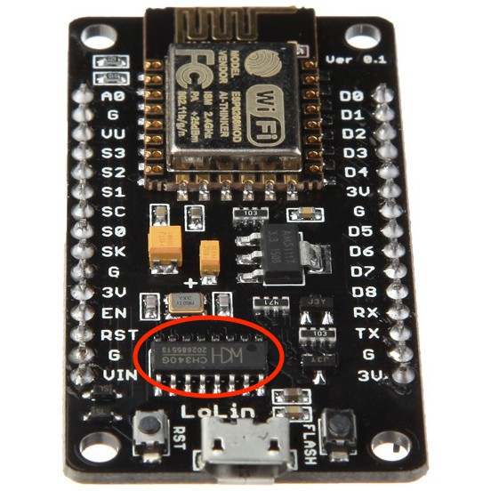
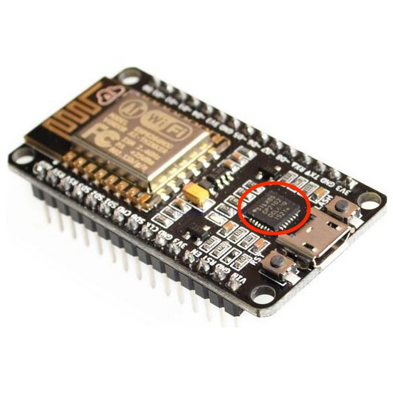
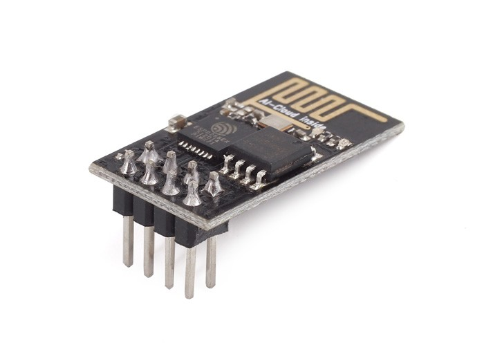
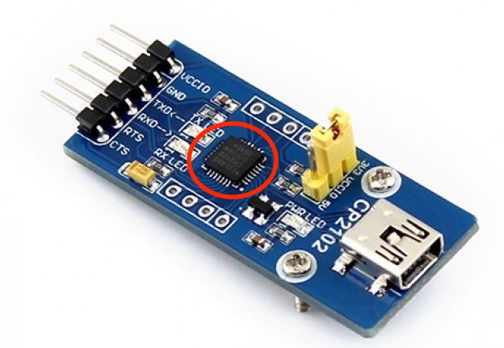

# USB-UART Converter Drivers

You will need to connect your ESP8266 device to your development machine. This connection will most probably be over USB port. In this case you will need to install appripriate driver on your machine. Exact driver depends on USB-UART chip used on your device. It is most probably one of those below:

- CH340G - [drivers](https://sparks.gogo.co.nz/ch340.html)
- CP2102 - [drivers](https://www.silabs.com/products/development-tools/software/usb-to-uart-bridge-vcp-drivers)

It is easy to understand which one is yours if you know where to look. In case you can't read what is written on a chip, CH340G is more rectangular one:

CP2102 is a square one:

In case you are using a module without USB-UART chip onboard, like this one:

then you will need a separate USB-UART converter, for instance like the one shown below. It will still have some USB-UART chip on it, which indicates what driver you need. CP2102 in this case:

## TODO

- include a schema of an ESP-8266 module and a separate USB-UART connection
- possible explain an option of using Arduino Uno as a USB-UART converter.
